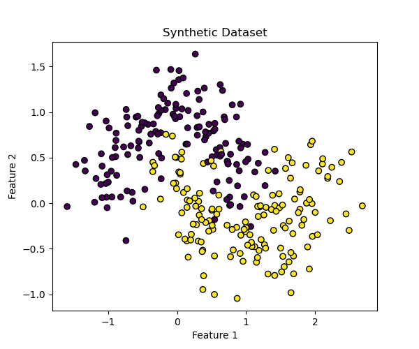
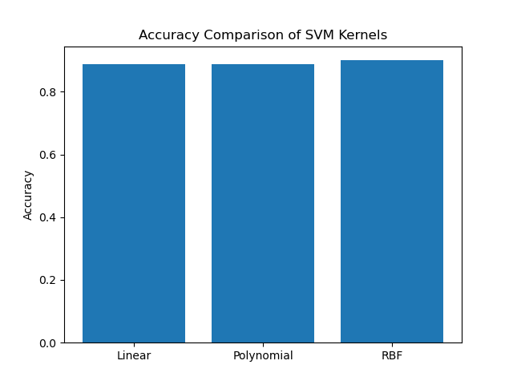
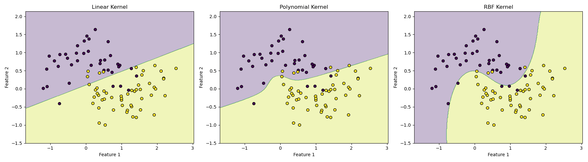

# SVM Kernel Tutorial

This project demonstrates how different kernel functions affect the performance of Support Vector Machines (SVM).

The tutorial compares:

- Linear Kernel
- Polynomial Kernel
- RBF Kernel

The implementation uses Python and Scikit-learn.
The tutorial uses a synthetic dataset generated with Scikit-learn and visualizes decision boundaries for each model.

## Files
- `svm_kernel_tutorial.ipynb` – main tutorial notebook
- `figures/` – plots generated during experiments
- 
## Results

### Dataset Visualization

### Accuracy Comparison

### Kernel Decision Boundaries

